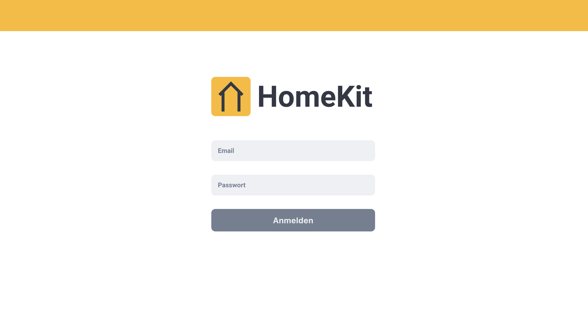
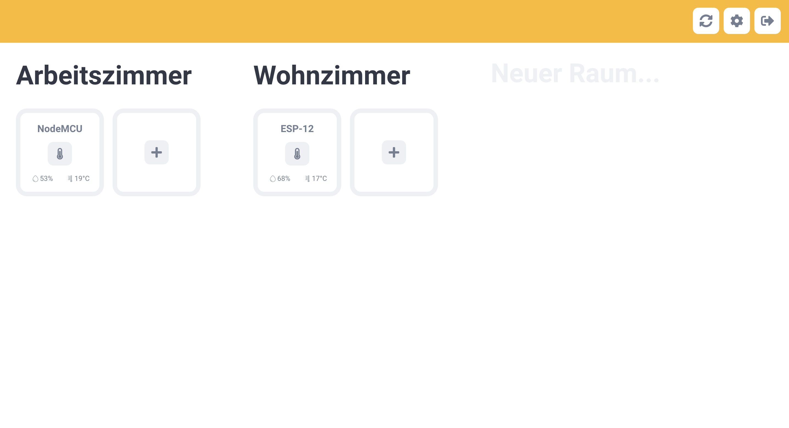
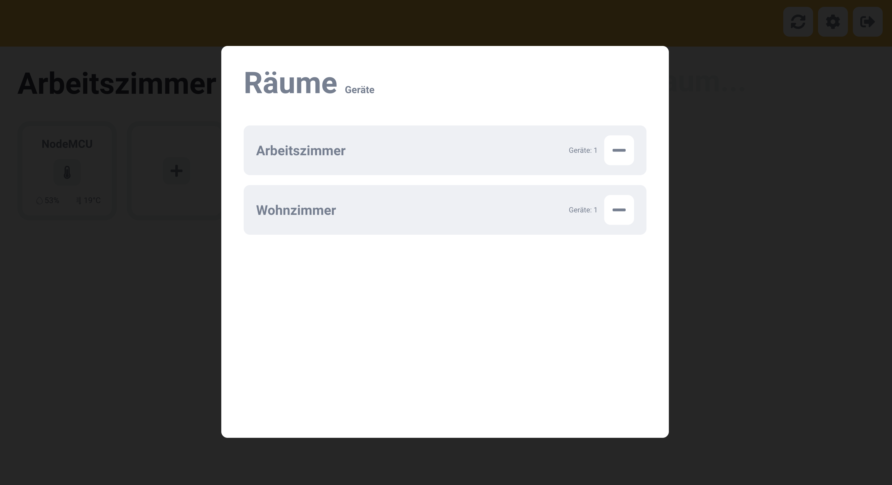
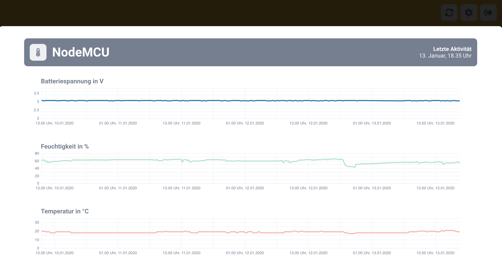

# HomeKit - Website

Personal HomeKit Project for displaying IoT Data from Firebase and controlling self made smarthome Devices in my home.

## Login

## Dashboard

Dashboard displaying the created rooms and assigned devices. Color displays the device state, active or inactive.

## Device and Room Management

Dialog for deleting rooms and devices. Also you can name devices via changing tabs.

## Data Visualization

Data Visualization via [Nivo](https://github.com/plouc/nivo) Framework.

